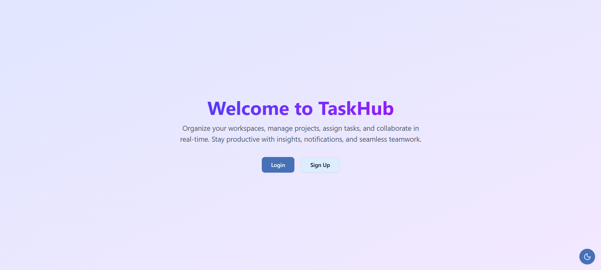
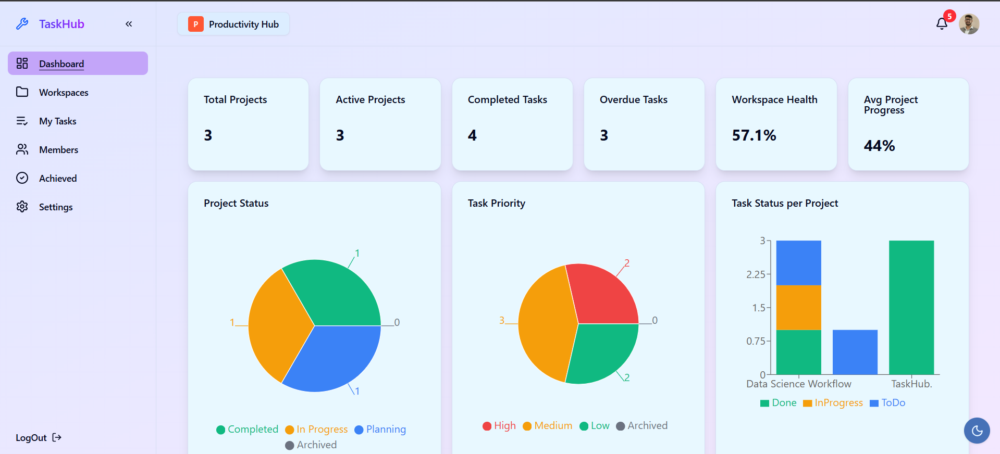
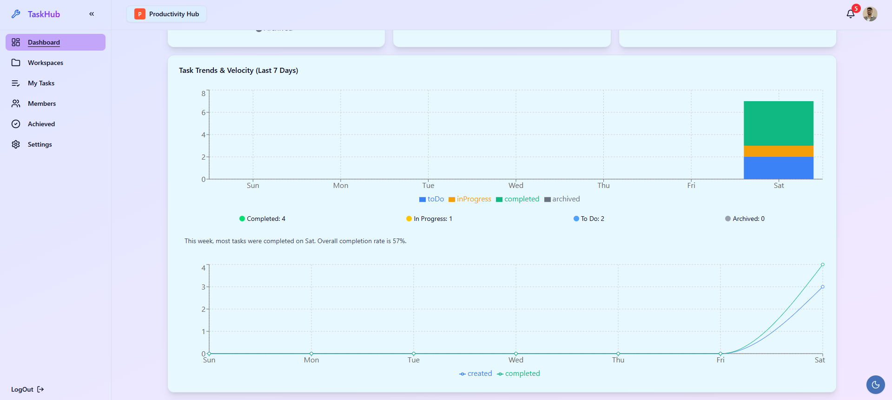
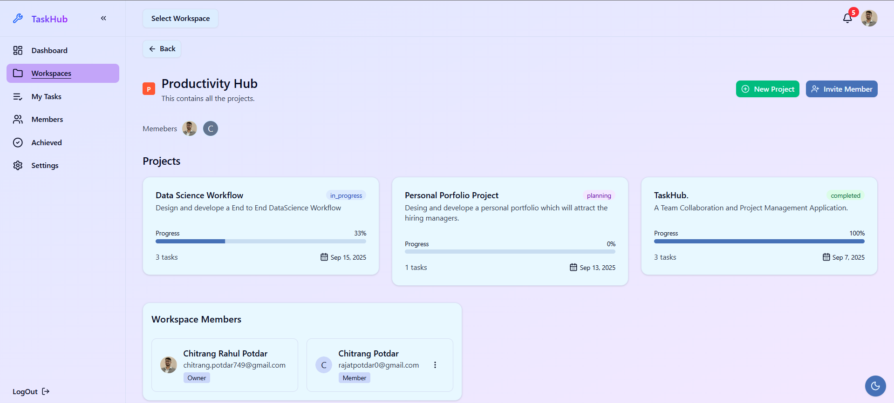
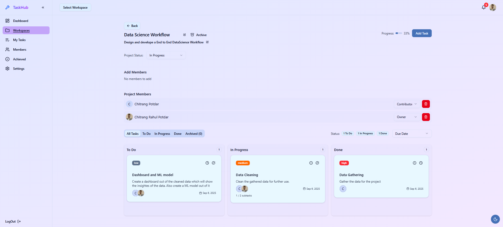

# TaskHub

TaskHub is a modern collaborative project management platform built with FastAPI, Next.js, and PostgreSQL. It allows teams to create workspaces, manage projects and tasks, assign members, upload files, and visualize insights — all with real-time notifications and secure authentication.

## Features

### Authentication

* Email sign-up with verification
* Sign-in with Two-Factor Authentication (2FA)
* Forgot & reset password functionality

### Workspaces

* Create and manage workspaces
* Invite members to workspaces
* Role-based access (Owner, Manager, Contributor, Viewer)

### Projects

* Create projects within a workspace
* Assign members to projects
* Change project statuses with rules (all tasks completed before marking done)
* Archive/unarchive projects

### Tasks & Subtasks

* Create tasks and subtasks
* Assign tasks to members
* Track task progress & statuses
* Upload files/attachments for tasks# TaskHub

TaskHub is a modern collaborative project management platform built with FastAPI, Next.js, and PostgreSQL. It allows teams to create workspaces, manage projects and tasks, assign members, upload files, and visualize insights — all with real-time notifications and secure authentication.

## Features

### Authentication

* Email sign-up with verification
* Sign-in with Two-Factor Authentication (2FA)
* Forgot & reset password functionality

### Workspaces

* Create and manage workspaces
* Invite members to workspaces
* Role-based access (Owner, Manager, Contributor, Viewer)

### Projects

* Create projects within a workspace
* Assign members to projects
* Change project statuses with rules (all tasks completed before marking done)
* Archive/unarchive projects

### Tasks & Subtasks

* Create tasks and subtasks
* Assign tasks to members
* Track task progress & statuses
* Upload files/attachments for tasks
* Manage priorities, tags, and watchers

### Dashboard & Insights

* Visualize workspace data
* Monitor progress across projects
* Track completion rates and productivity

### Members Management

* Manage member roles and permissions
* View workspace members list

### Live Notifications

* Real-time updates using WebSockets
* Get notified on project updates, assignments, and status changes

## Tech Stack

* **Backend:** FastAPI (Python)
* **Frontend:** Next.js + TailwindCSS
* **Database:** PostgreSQL
* **Realtime:** WebSockets

## Images












## Installation & Setup

### Prerequisites

* Python 3.10+
* Node.js 18+
* PostgreSQL

### Backend (FastAPI)

```bash
cd backend
python -m venv venv
source venv/bin/activate   # On Windows: venv\Scripts\activate
pip install -r requirements.txt
python app.py

### Frontend (Next.js)
cd frontend
npm install
npm run dev

### Database (PostgreSQL)
1. Create database named **'taskhub'**.
2. Update the connection details in backend.
3. Run migrations (if using Alembic or similar)

.
├── backend
│   ├── app.py
│   ├── config.py
│   ├── routes
│   │   ├── task.py
│   │   └── ...
│   └── schema
│       └── workspace.py
├── frontend
│   ├── app
│   │   ├── (protected)
│   │   │   └── workspaces
│   │   │       └── [WorkSpaceid]
│   │   │           └── projects
│   │   │               └── [Projectid]
│   │   │                   └── tasks
│   │   │                       └── [TasksId]
│   │   │                           └── page.js
│   │   └── layout.js
│   ├── components
│   │   ├── dashboard
│   │   │   ├── RecentProjects.js
│   │   │   └── StackedTaskChart.js
│   │   ├── layout
│   │   │   └── SidebarComponent.js
│   │   ├── tasks
│   │   │   └── CreateTaskDialog.js
│   │   ├── ui
│   │   │   ├── card.jsx
│   │   │   └── select.jsx
│   │   └── workspace
│   │       └── project
│   │           └── CreateProjectDialog.js
│   ├── hooks
│   ├── lib
│   ├── package.json
│   └── provider
│       └── query-provider.js
├── .gitignore
└── README.md

## Contributing
Pull requests are welcome. For major changes, please open an issue first to discuss what you’d like to change.

## License
TaskHub is licensed under the MIT License.
